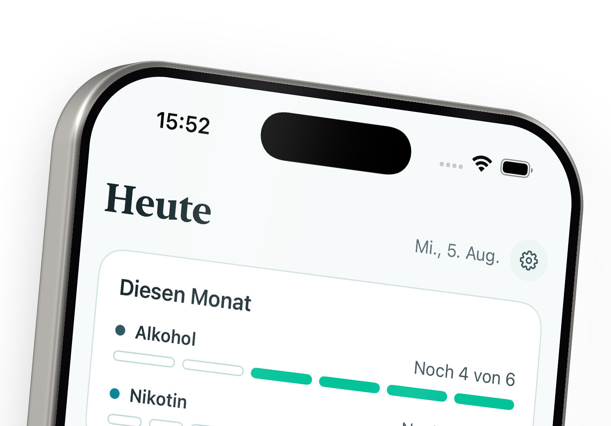

# Klar

An iOS app for people who want to cut down on their substance use without quitting.
No account, no server, no analytics — the data never leaves the phone.

<picture>
  <source media="(prefers-color-scheme: dark)" srcset="docs/screenshots/rendered/heute-dark.png">
  
</picture>

German UI, German market first. Not shipped: no App Store release and no external
users yet. All fifteen screens, light and dark, are in
[`docs/screenshots/`](docs/screenshots/) — every number in them comes from the
sample dataset in [`examples/`](examples/), nothing is mocked up.

## Why this is not a tracker

Logging on its own barely moves consumption. That is the starting point rather
than an afterthought: across the ecological momentary assessment literature
(Shiffman, 2009) and a randomised diary experiment (Buu et al., 2020),
self-monitoring produces little to no lasting change, and the authors of the
latter attribute that directly to the absence of any feedback layer.

The one piece of app-level component evidence is a 2⁵-factorial trial of the
Drink Less app (Crane et al., 2018). It found no significant main effect for any
individual module, but a significant interaction between self-monitoring and
action planning. So Klar builds those two as a pair: every entry feeds a quota and
a weekly review, and the if-then plan sits on the same screen as the log.

The same evidence decided what to leave out. Normative feedback ("you drink less
than 70% of users") has meta-analytic support and is deliberately absent, because
no valid norm data exists for illegal substances and a user below the average
reads it as permission.

The full argument, the design principles derived from it, and an explicit section
on the limits of the evidence are in
[`docs/klar-mvp-konzept.md`](docs/klar-mvp-konzept.md).

## What it does

Entry logging with context tags, per-substance monthly quotas, if-then action
plans with check-ins, a three-step weekly review, calendar and trend history,
behaviour substitution prompts, and a craving SOS screen with attributed content
from established organisations.

## Architecture

Two pieces, split along a line that is enforced rather than aspirational:

- **[`Klar/`](Klar/)** — the Xcode project. SwiftUI views, SwiftData persistence,
  app lifecycle, design system, app lock.
- **[`Packages/KlarCore/`](Packages/KlarCore/)** — the domain logic as a local Swift
  package. Quota calculation, statistics, plan sentences, logical-day handling.

Every file in `KlarCore` imports `Foundation` and nothing else. No SwiftData, no
UIKit, no SwiftUI. That is what makes the interesting logic testable in
milliseconds on a plain Mac, with no simulator and no Xcode in the loop:

```bash
swift test --package-path Packages/KlarCore   # 23 tests, ~8 ms
```

The package declares `.iOS(.v17)` while the app targets 26.5. The core is
deliberately the more portable half.

Alongside those: [`docs/`](docs/) holds the concept notes, pitch material and
screenshots, [`examples/`](examples/) an importable sample dataset covering every
screen, regenerated by [`tools/`](tools/), and [`web/`](web/) the landing page.

## Privacy, as something checkable

"Privacy-first" is easy to write, so here is what it means in the repo:

- No networking code exists. There is no `URLSession`, no CloudKit and no
  analytics SDK anywhere in the sources.
- [`PrivacyInfo.xcprivacy`](Klar/Klar/PrivacyInfo.xcprivacy) declares no tracking
  and an empty set of collected data types.
- The store is entitled `NSFileProtectionComplete` and
  [excluded from iCloud backup](Klar/Klar/Persistence/BackupExclusion.swift), so
  the data cannot leave the device through a backup either.
- Optional Face ID lock, plus a [snapshot shield](Klar/Klar/Security/SnapshotShieldView.swift)
  that covers the UI in the app switcher.

## A decision worth naming

A day does not end at midnight. Someone logging a drink at 02:00 means the night
that started yesterday, and a quota rolling over at 00:00 would split one evening
across two months.

[`LogicalDay`](Packages/KlarCore/Sources/KlarCore/LogicalDay.swift) therefore puts
the boundary at 05:00 and does every comparison in an explicit timezone. The cost
is a window between midnight and 05:00 where the date the app shows disagrees with
the phone's clock. Rather than hide that, `isBeforeCutoff` exists so the UI can say
which day it means. A silent contradiction there would be worse than an explanation.

## Running it

Xcode 26.6+, iOS 26.5+. Open `Klar/Klar.xcodeproj`, select the `Klar` scheme and
run — there is nothing to configure, no API keys and no backend to point at. To
get the screens populated, import [`examples/klar-beispieldaten.json`](examples/)
from Einstellungen → Daten. `KlarCore` on its own needs only a Swift toolchain.

## Limitations

Almost all the cited evidence comes from alcohol and tobacco research. Applying it
to other substances is a plausible extrapolation, not an established result, and
the concept document says so at more length. This is not a medical product and
makes no therapeutic claim, and there is no evaluation in its own context yet. The
UI is German only, and there is no CI.

## License

MIT, see [LICENSE](LICENSE).
